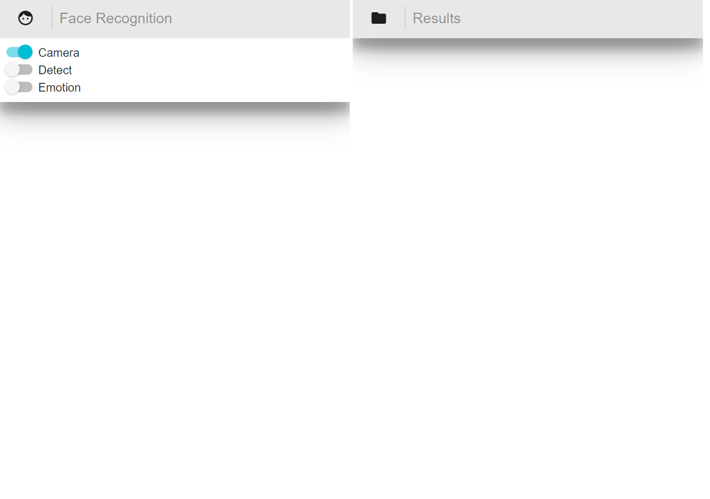
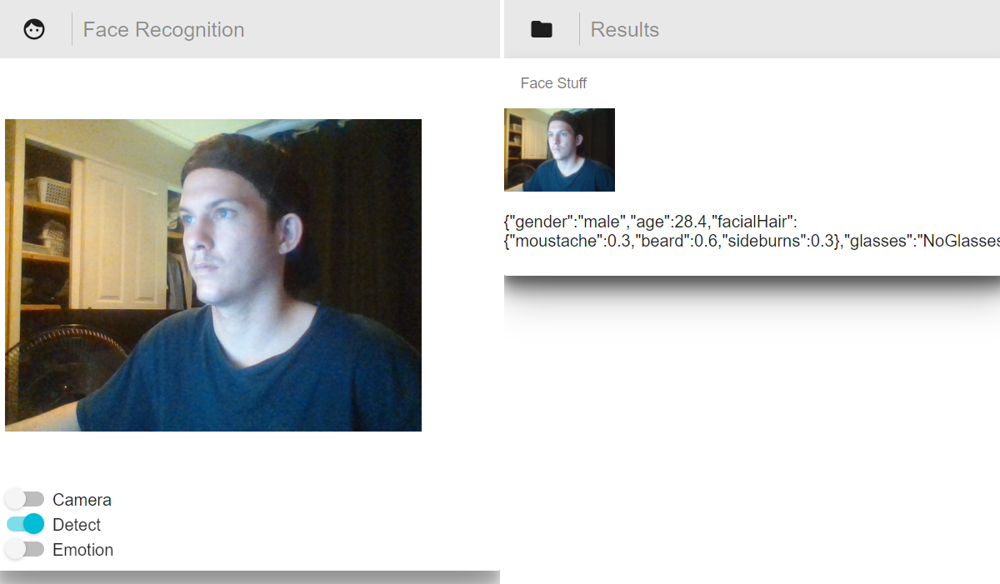
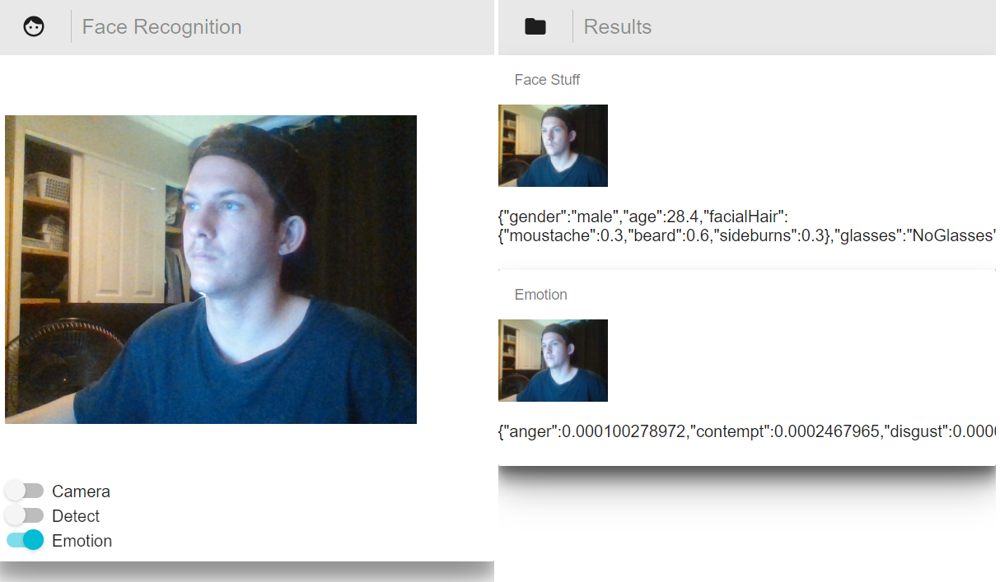

# React Face API

# The Project
Learning react and redux to build a web application which used 
azure face api to detect emotion and face attribute.

# Things to fix and improvements
fix - parsing the data 
    - unit tests and error checking 
    - pretty it up
    - to many things
    - fix material-ui stuff
improvements - speech
             - object detection
             - match faces
             - make a list of face and train etc
             - graphs

# Screenshots

